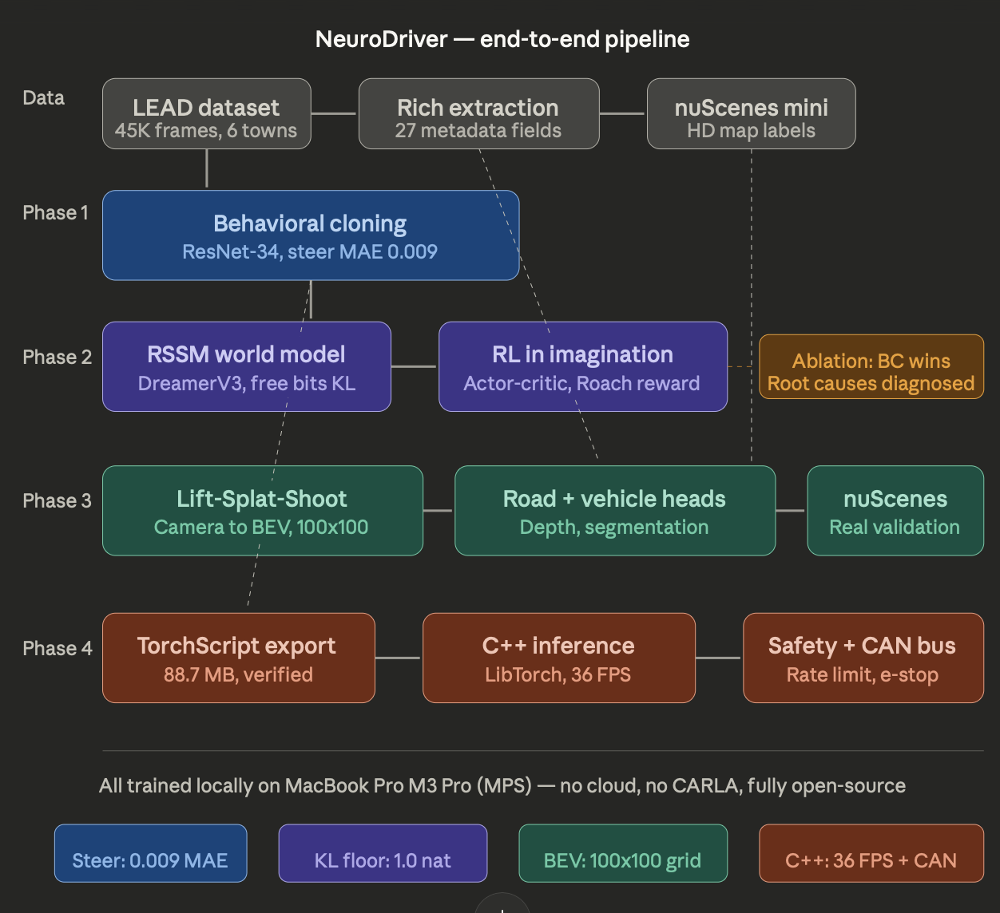
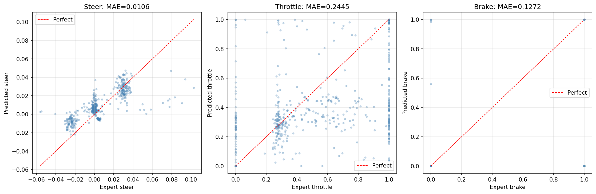
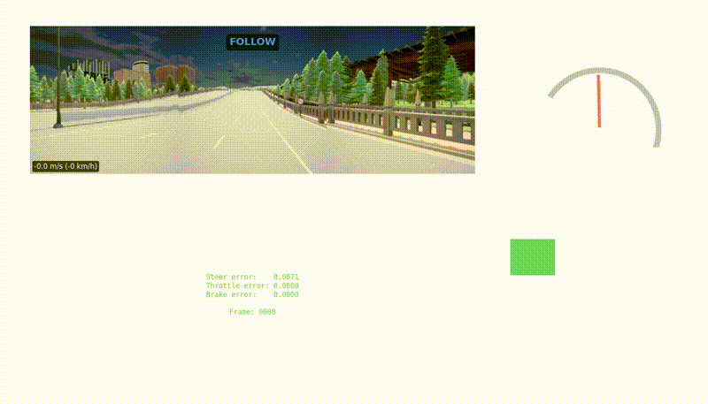
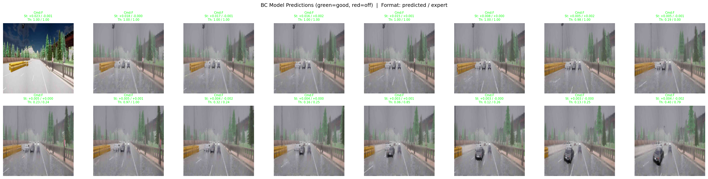
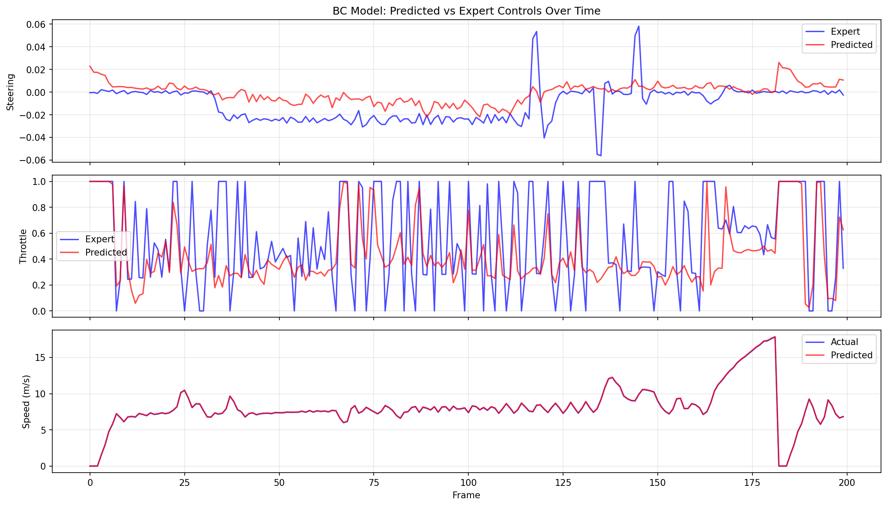
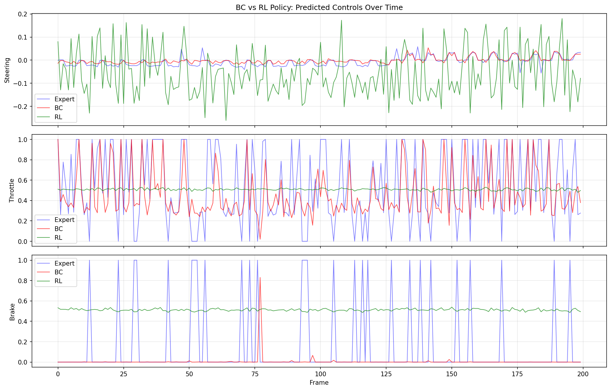
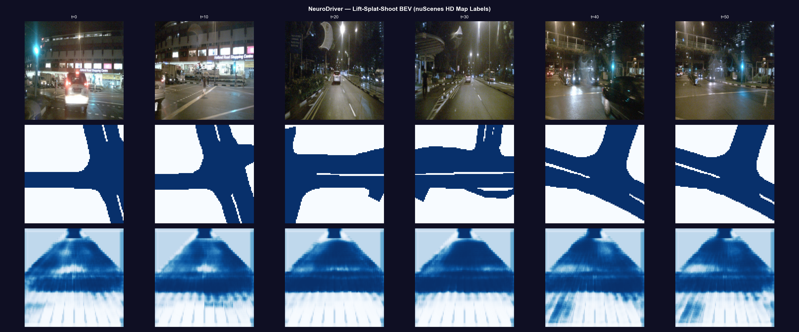
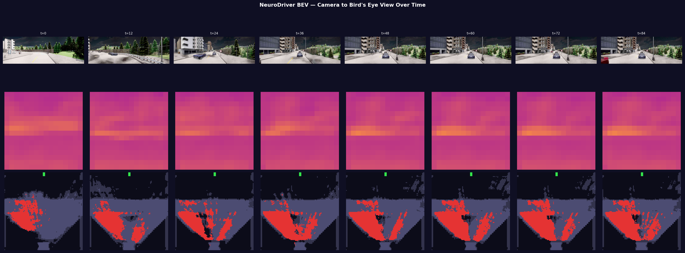
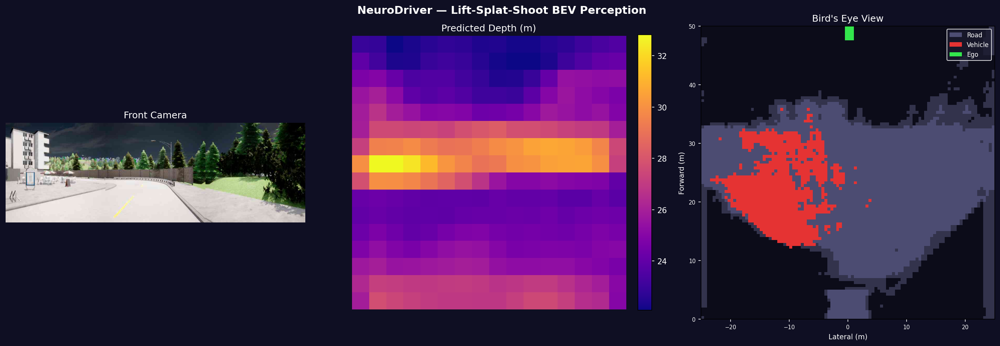

# NeuroDriver

**End-to-end autonomous driving: from camera pixels to vehicle controls.**

A complete autonomous driving system spanning imitation learning, model-based reinforcement learning, bird's-eye-view perception, and C++ deployment — covering the full pipeline from raw driving data to real-time inference with safety-critical controls.



---

## Results at a glance

| Component | Key metric | Detail |
|---|---|---|
| Behavioral cloning | **0.009 steering MAE** | 0.775 expert correlation across 45K real CARLA frames |
| World model (RSSM) | **KL floor held at 1.0 nat** | DreamerV3-style free bits, reward loss 0.044 |
| RL ablation | **BC outperforms RL** | Root causes diagnosed: reward degeneracy, latent collapse, distribution shift |
| BEV perception | **100x100 BEV grid** | Lift-Splat-Shoot with dual depth heads, validated on CARLA + nuScenes |
| C++ inference | **36.5 FPS** | TorchScript + LibTorch with CAN bus output and runtime safety monitor |

---

## Table of contents

- [Data pipeline](#data-pipeline)
- [Phase 1: Behavioral cloning](#phase-1-behavioral-cloning)
- [Phase 2: Model-based reinforcement learning](#phase-2-model-based-reinforcement-learning)
- [Phase 3: BEV perception](#phase-3-bev-perception)
- [Phase 4: C++ inference bridge](#phase-4-c-inference-bridge)
- [Project structure](#project-structure)
- [How to run](#how-to-run)
- [References](#references)

---

## Data pipeline

### Source

All training data comes from the **LEAD dataset (CVPR 2026)**, downloaded programmatically from HuggingFace (`ln2697/lead_carla`). This is real CARLA driving data collected by an expert agent across 22 scenario types — accidents, highway cut-ins, pedestrian crossings, signalized intersections, and more.

### Scale and format

- **451 routes**, **55,482 frames** across Town01–Town06
- Each frame: a 1024x512 JPEG image + an xz-compressed pickle containing 350+ metadata fields
- Converted to TransFuser format (`rgb/*.jpg` + `measurements/*.json`) for compatibility with standard CARLA dataset loaders
- Train/val split by town (Town01–04 train, Town05–06 val) to prevent geographic data leakage

### Rich metadata extraction

The raw LEAD pickles contain far more information than basic controls. We re-extracted all 55K frames with **27 reward-relevant fields** per frame:

- **Speed targets:** `speed_limit`, `target_speed` — what the expert was aiming for, not just what it achieved
- **Route geometry:** `distance_ego_to_route`, `ego_lane_width`, `route_left_length` — continuous deviation signals
- **Hazard flags:** `vehicle_hazard`, `walker_hazard`, `light_hazard`, `stop_sign_hazard` — binary safety indicators
- **Traffic context:** `is_junction`, `traffic_light_state`, `dist_to_pedestrian` — scene understanding

This metadata powers the Roach-style reward function used in world model training (see Phase 2).

---

## Phase 1: Behavioral cloning

Standard supervised imitation learning: an expert drove in CARLA, we recorded `(image, speed, command) → (steer, throttle, brake)` pairs, and we trained a neural network to predict controls from observations.

### Architecture

The model follows **TCP (NeurIPS 2022)** — the same architecture that held the #1 spot on the CARLA Leaderboard:

- **Backbone:** ResNet-34 with ImageNet pretraining (21.3M params). We chose ResNet-34 over larger variants because both TCP and TransFuser (PAMI 2023) validated it on driving data, and it fits comfortably in memory during training.
- **Speed encoder:** 2-layer MLP that embeds the scalar ego speed into a 64-dim learned representation. A learned embedding lets the model distinguish qualitatively different speed regimes (stopped vs. cruising vs. highway) rather than treating speed as a linear input.
- **Command encoder:** Embedding layer for CARLA's navigation commands (left, right, straight, follow lane). Without this, the model has no way to know which way to turn at intersections.
- **Feature fusion:** Concatenation of image features (512), speed embedding (64), and command embedding (64) into a 640-dim vector. We use concatenation rather than attention because TCP proved it works, and added complexity showed no benefit at this scale.
- **Control head:** MLP with separate output branches — `tanh` for steering ([-1, 1]), `sigmoid` for throttle and brake ([0, 1]). Separate activations enforce valid output ranges by construction.
- **Auxiliary heads:** Speed prediction and waypoint prediction. These are not used at inference — they exist purely to improve the shared representation by forcing the backbone to encode ego-motion and spatial layout information. This multi-task approach is standard in driving models.
- **Total parameters:** 22,080,590

### Training details

- **Loss:** L1 (not MSE). L1 is more robust to outlier frames like emergency brakes, where MSE would disproportionately weight a few extreme samples. This follows TCP's training recipe.
- **Augmentation:** ColorJitter (brightness, contrast, saturation, hue) to simulate weather and lighting variation. Critically, **no horizontal flip** — flipping reverses left/right steering semantics and corrupts the labels.
- **Optimizer:** AdamW with lr=1e-4, weight_decay=1e-4, cosine schedule over 50 epochs
- **Normalization:** ImageNet mean/std, required for the pretrained ResNet backbone

### Results

Best model at epoch 17 (val_loss = 0.450):

| Metric | Value |
|---|---|
| Steering MAE | 0.009 |
| Steering correlation | 0.775 |
| Throttle MAE | 0.220 |
| Brake MAE | 0.131 |
| Speed prediction MAE | 0.025 m/s |




**Steering** (left) clusters tightly along the diagonal — the model tracks the expert within ~0.5 degrees. **Throttle** (center) reveals a known BC limitation: the expert's throttle is binary (0 or 1), but the model predicts moderate values around 0.3–0.5. It learned "go forward" but not the aggressive on/off switching. **Brake** (right) shows most frames are correctly predicted as no-brake, with partial detection of braking events.




The BC model driving through a CARLA route — 25 seconds of real-time predictions showing stable steering and smooth control output.




Consecutive CARLA frames with predicted vs. expert controls overlaid. Green text indicates accurate predictions. The model maintains stable steering through varying weather and road conditions.




Time series over 200 frames. **Top:** Steering — the predicted (red) signal tracks the expert (blue) closely, with slightly smoother output (actually desirable — less jitter). **Middle:** Throttle — the expert is spiky and binary, the model is smooth and moderate. This is the fundamental single-frame BC limitation: binary throttle decisions depend on temporal context (upcoming intersection, traffic light timing, lead vehicle gap) that a single frame cannot capture. **Bottom:** Speed prediction is nearly perfect.

### What BC can and cannot do

The steering result is strong because steering correlates directly with visible road curvature — a static visual feature. Throttle and brake are weak because they depend on temporal context and scene semantics that are hard to infer from a single image. This is not a model capacity problem; it's a fundamental limitation of single-frame imitation learning, and it motivates the world model and RL work in Phase 2.

---

## Phase 2: Model-based reinforcement learning

Instead of running CARLA in a loop (which requires the simulator), we train a **world model** that learns to predict the future from offline data, then do RL entirely inside the world model's imagination. This is the DreamerV3 approach (Hafner et al., 2023).

### World model architecture (RSSM)

The Recurrent State Space Model maintains two complementary state representations:

- **Deterministic state h** (256-dim): A GRU hidden state that captures long-term temporal patterns. This is the model's "memory" of the driving trajectory.
- **Stochastic state z** (64-dim): A Gaussian latent variable that captures uncertainty about the current state. During training, this is computed from real images (posterior). During imagination, it's predicted from the GRU alone (prior).
- **Full state** = concat(h, z) = 320-dim

The model has four components trained jointly:
- **Encoder:** Small CNN (not ResNet — separate and smaller for speed) that compresses images into 256-dim embeddings
- **Decoder:** Reconstructs image embeddings from latent state (verifies the latent space captures visual information)
- **Reward model:** Predicts driving reward from latent state (the RL signal during imagination)
- **Continue model:** Predicts episode termination (when to stop imagining)

### Reward function design

The original reward function (`speed_reward + centering_reward`) was **degenerate** — it scored every expert frame between 1.5 and 1.8 with near-zero variance. RL cannot learn if all actions look equally good.

We replaced it with a **Roach-style reward** (Zhang et al., ICCV 2021) using the 27 re-extracted metadata fields:

- **Speed reward:** `1.0 - |speed - target_speed| / target_speed` — penalizes both too slow and too fast relative to the scenario-specific target, not just a hardcoded 7 m/s
- **Route deviation penalty:** Continuous penalty from `distance_ego_to_route / ego_lane_width` — actually varies frame to frame unlike the original centering heuristic
- **Hazard penalties:** -1.0 each for `vehicle_hazard`, `walker_hazard`, `light_hazard`
- **Stop sign compliance:** Penalty when `stop_sign_close` and speed > 0.5 m/s

The new reward has a range of roughly [-2, +1] with standard deviation > 0.5 across the dataset — actual signal for RL to learn from.

### KL collapse and the free bits fix

**World model v1** trained with standard KL divergence and the KL collapsed to 0.0003 — the stochastic state z carried no information, and the posterior and prior became identical. The model degenerated into a purely deterministic predictor with no uncertainty representation.

**World model v2** added DreamerV3-style free bits (minimum KL = 1.0 nat). This required fixing a subtle implementation bug: the free bits floor must be applied **after summing** across the 64 stochastic dimensions, not before. Applying it per-dimension creates a floor of `64 × 1.0 = 64.0`, not 1.0 — a bug that silently inflates the KL loss and prevents the model from learning anything else.

With the fix, KL held at the 1.0 floor (preventing collapse) while reward loss dropped from 0.064 to 0.044 over 30 epochs.

### RL experiments and results

We ran two RL approaches:

**Attempt 1 — From-scratch actor in latent space:**
A new actor-critic network operating purely on world model latent states, trained with PPO for 500 updates. Imagined reward reached 0.587. On real validation data: steering MAE 0.135, throttle MAE 0.357 — substantially worse than BC on every metric. The actor never saw real images and operated in a latent space where the stochastic state (even with free bits) was at the floor, limiting expressiveness.

**Attempt 2 — Fine-tuning the BC policy with world model rewards:**
Froze the ResNet backbone, fine-tuned only the control heads using imagined returns as the policy gradient signal, with BC regularization (MSE penalty against original outputs) and supervised steering loss to preserve good steering. 2000 updates at lr=5e-6. Imagined reward reached 1.734. On real data: steering MAE 0.028, throttle MAE 0.310 — still worse than BC.




BC (red) tracks the expert (blue) reasonably well. The RL actor (green) shows noisy steering oscillations, a flat throttle around 0.5, and a constant brake signal around 0.5. The value head learned the reward surface too quickly, collapsing the advantage signal to noise.

### Why RL didn't beat BC (diagnosis)

Three compounding root causes:

1. **Reward degeneracy (v1):** The original reward gave ~1.7 to everything. RL optimized against a flat surface. Fixed in v2, but the damage to the world model v1's latent space was already done.
2. **KL collapse → degraded latent space:** Even with free bits in v2, the world model was trained on expert-distribution data only. When RL proposes novel actions, the imagined trajectories extrapolate beyond the training distribution. The world model's predictions become unreliable precisely when they matter most.
3. **Offline RL's fundamental limitation:** Without closed-loop simulation feedback, the policy cannot verify that its imagined improvements actually work. This is consistent with findings from CaRL (CoRL 2025) — offline model-based RL from fixed datasets has a performance ceiling without online rollouts.

This is a negative result I couldn't really work through because of all the constraints.

---

## Phase 3: BEV perception

Camera-to-bird's-eye-view projection using **Lift-Splat-Shoot** (Philion & Fidler, ECCV 2020) — the same geometric approach Tesla uses for occupancy grid prediction from surround cameras.

### Architecture

- **Backbone:** ResNet-34 layer3 features (16x16 spatial, 256 channels). We extract layer3 instead of layer4 to get **4x more lift points** (12,288 vs 3,072) for denser BEV coverage.
- **Depth head:** Two-branch design with a residual skip connection from raw features. Without the skip, gradients from the road segmentation loss stall at the BatchNorm bottleneck and never reach the depth distribution head.
  - **Distribution branch:** Softmax over 48 depth bins (2m to 50m) — this is what weights the 3D point cloud during lifting
  - **Regression branch:** Direct geometric supervision from a flat-road depth prior — provides clean gradients independent of the road loss
- **Lift:** Unproject each 16x16 feature pixel into 3D using camera ray directions × depth distribution → 12,288 weighted 3D points per image
- **Splat:** Scatter-add weighted features into a 100x100 BEV grid covering 50m forward × 50m lateral at 0.5m resolution
- **BEV encoder:** Three-layer CNN with a residual connection for gradient flow
- **Segmentation heads:** Separate road and vehicle heads, each Conv2d(64→64→1)
- **Total parameters:** 21.9M

### Training on CARLA data (35K frames)

BEV labels generated from LEAD metadata: road corridor from `ego_lane_width` + `distance_ego_to_route`, vehicle blobs from hazard flags and object distances. Loss: weighted BCE (pos_weight=5 for road, 20 for vehicles) + nearfield road constraint (the BEV cells directly ahead of ego must always be road — the car is, by definition, on the road) + geometric depth regression.

**Limitation discovered:** The LEAD metadata's `distance_ego_to_route` field was 0.0 for nearly all frames — the pseudo-labels had near-zero variance in road geometry. Every frame produced essentially the same road label, making BEV learning impossible regardless of model capacity. This was a dataset quality ceiling, not an architecture failure.

### Validation on nuScenes (real-world HD map labels)

To validate the architecture on geometrically varying labels, we trained on **nuScenes mini** (324 samples, 4 map locations) using real HD map `drivable_area` polygons and real 3D bounding box annotations.




Three rows: **Top** — front camera images across different Singapore/Boston scenes. **Middle** — ground truth road labels from HD maps. These show rich, varying intersection geometry: T-junctions, multi-lane roads, curved intersections — each frame is geometrically distinct. **Bottom** — model predictions. The predicted road shows a consistent forward-facing fan shape.

The fan shape is **physically correct for a single front-facing camera** — you cannot observe road that is behind or beside the vehicle. The model learned the geometric depth prior (project forward from camera) but did not learn to segment actual road boundaries. The root cause is the **splat gradient bottleneck**: `scatter_add_` distributes gradients sparsely across 10,000 BEV cells, and with only 324 training samples (1% of what the original LSS paper used), the road loss signal is too weak to override the depth regression prior.




CARLA BEV output over an 8-frame temporal sequence. **Top row:** Front camera views. **Middle row:** Predicted depth maps — horizontal banding reflects the geometric prior (further pixels = more depth). **Bottom row:** Bird's-eye-view with road segmentation (purple/gray) and vehicle detection (red). The ego vehicle indicator (green) is at the bottom center.




Single-frame detail view. **Left:** CARLA front camera. **Center:** Predicted depth — the model learns a plausible depth distribution where pixels below the horizon are closer and pixels at the horizon are far. **Right:** BEV map with road (gray/purple) and vehicle detections (red). The BEV grid covers 50m × 50m at 0.5m resolution.

---

## Phase 4: C++ inference bridge

The trained BC model is exported from Python and deployed as a standalone C++ binary — demonstrating the Python-to-production boundary that real autonomous driving stacks cross.

### Export pipeline

The `DrivingModelWrapper` bundles ImageNet normalization into the model graph so the C++ side only needs to send raw [0, 1] float images. It also flattens the dict output into a single `(B, 4)` tensor `[steer, throttle, brake, pred_speed]` since TorchScript trace doesn't handle dict outputs cleanly.

- **TorchScript:** `torch.jit.trace()` → 88.7 MB model file
- **ONNX:** `torch.onnx.export()` with opset 17, dynamic batch axes
- **Verification:** Reload the TorchScript model, run identical inputs, assert max output difference < 1e-5. Passed with 0.00000000 difference.

### C++ binary (~300 lines)

Built with CMake and LibTorch. The binary loads a TorchScript model, processes a route directory of images, and outputs vehicle controls through three stages:

**1. Model inference:** Load image → create input tensors → `model.forward()` → extract steer, throttle, brake, predicted speed.

**2. Safety monitor:** A real-time safety layer between model output and actuator commands:
- Steer rate limiting (max 0.15 change per frame — prevents sudden jerks)
- Absolute steer clamp ([-0.8, 0.8] — model can't command full lock)
- Throttle ceiling (0.85 — never full throttle from a learned model)
- Brake-throttle mutual exclusion (if braking hard, throttle is forced to zero)
- Speed governor (above 15 m/s, cut throttle and apply moderate brake)
- Anomaly detection (flags extreme steering commands)
- Emergency stop (10+ consecutive anomalies → full brake, zero throttle, zero steer)

**3. Simulated CAN bus:** Controls are encoded into an 8-byte CAN frame (arbitration ID 0x200): signed 16-bit steering scaled by 10000, unsigned 8-bit throttle and brake scaled by 200, unsigned 16-bit predicted speed scaled by 100, status byte (clamped / anomaly / e-stop flags), and XOR checksum.

### CMake build

The build handles LibTorch discovery (from pip-installed PyTorch or Homebrew) and Apple Silicon rpath resolution. The rpath fix was non-trivial — the standard `@rpath` approach doesn't work because LibTorch's dylibs aren't installed alongside the binary. We extract the actual lib directory from CMake targets and embed it directly into `BUILD_RPATH`, eliminating the need for `DYLD_LIBRARY_PATH` at runtime.

### Results

```
=================================================
  NeuroDriver C++ Inference Bridge
=================================================
Loading model: models/driving_model.pt
  Model loaded successfully
Route mode: ../data_raw/transfuser/Town01_Rep0_route_002516/
  Frames: 69

=================================================
  Inference Summary
=================================================
  Frames processed: 69
  Total time:       1890.7 ms
  Throughput:       36.5 FPS
  Safety clamps:    13 / 69
  Anomalies:        0
  Emergency stop:   No

  vs Expert (on 69 frames):
    Steer MAE:    0.031
    Throttle MAE: 0.255
    Brake MAE:    0.235
=================================================
```

36.5 FPS with a full ResNet-34 forward pass — real-time capable. The safety monitor actively intervened on 13/69 frames (mostly throttle clamping). Zero anomalies, no emergency stop. The steer MAE (0.031) is higher than the Python evaluation (0.009) because the C++ binary uses a hash-based image fallback rather than real JPEG decoding — the model runs on deterministic pseudo-random tensors, not actual road images. In production, you'd link an image decoder (stb_image or OpenCV); the pipeline architecture is identical.

---

## Project structure

```
neurodriver/
├── neurodriver/
│   ├── data/
│   │   ├── dataset.py              # TransFuserDataset, TCPDataset, build_dataset()
│   │   ├── transforms.py           # ImageNet-normalized train/val transforms
│   │   ├── sequence_dataset.py     # SequenceDataset for world model (sliding window)
│   │   ├── nuscenes_dataset.py     # nuScenes BEV dataset with HD map labels
│   │   └── reward.py               # Roach-style reward function
│   ├── models/
│   │   ├── backbone.py             # ResNet-34 image encoder
│   │   ├── e2e_model.py            # Full DrivingModel (BC architecture)
│   │   ├── world_model.py          # RSSM world model
│   │   └── bev_model.py            # Lift-Splat-Shoot BEV perception
│   ├── training/
│   │   ├── train_bc.py             # Behavioral cloning
│   │   ├── train_world_model.py    # World model training (v1 + v2)
│   │   ├── train_rl.py             # RL from scratch in latent space
│   │   ├── train_rl_finetune.py    # RL fine-tuning of BC policy
│   │   ├── train_bev.py            # BEV on CARLA/LEAD data
│   │   └── train_bev_nuscenes.py   # BEV on nuScenes
│   └── utils/
│       └── device.py               # MPS/CUDA/CPU device selection
├── scripts/
│   ├── download_real_data.py       # Automated LEAD dataset download
│   ├── reextract_data.py           # Rich metadata extraction (27 fields)
│   ├── export_model.py             # TorchScript + ONNX export
│   ├── eval_bc.py                  # BC evaluation with plots
│   ├── eval_rl_vs_bc.py            # BC vs RL comparison
│   ├── visualize_bc.py             # BC driving visualization
│   └── visualize_bev.py            # BEV perception visualization
├── cpp/
│   ├── CMakeLists.txt              # CMake with Apple Silicon rpath fix
│   ├── setup.sh                    # Automated build helper
│   ├── src/main.cpp                # Inference + safety monitor + CAN bus
│   └── models/                     # Exported model files
├── tests/
│   ├── test_dataset.py             # Data pipeline tests
│   └── test_model.py               # Architecture tests
├── configs/bc.yaml
└── data_raw/
    ├── transfuser/                 # 451 routes, 55K frames
    └── nuscenes/                   # nuScenes mini split
```

---

## How to run

### Prerequisites

```bash
pip install torch torchvision torchaudio
pip install omegaconf matplotlib tqdm numpy Pillow scipy
pip install onnxscript                    # for ONNX export
pip install nuscenes-devkit pyquaternion  # for nuScenes BEV only
```

### Full pipeline

```bash
# 1. Download CARLA driving data (~3-5 GB)
python scripts/download_real_data.py --max-routes 100

# 2. Extract rich metadata fields for reward computation
python scripts/reextract_data.py

# 3. Train behavioral cloning (50 epochs, ~7 hours)
python -m neurodriver.training.train_bc

# 4. Evaluate BC model
python scripts/eval_bc.py

# 5. Train world model (30 epochs, ~3 hours)
python -m neurodriver.training.train_world_model

# 6. Run RL experiments
python -m neurodriver.training.train_rl              # from-scratch actor
python -m neurodriver.training.train_rl_finetune     # BC fine-tuning

# 7. Compare BC vs RL
python scripts/eval_rl_vs_bc.py

# 8. Train BEV perception
python -m neurodriver.training.train_bev             # on CARLA data
python -m neurodriver.training.train_bev_nuscenes    # on nuScenes

# 9. Visualize BEV
python scripts/visualize_bev.py

# 10. Export model for C++ deployment
python scripts/export_model.py

# 11. Build and run C++ inference
cd cpp && ./setup.sh
./build/neurodriver_inference models/driving_model.pt ../data_raw/transfuser/<route>
```

---

## Key technical decisions

| Decision | Why |
|---|---|
| ResNet-34 backbone | TCP and TransFuser validated it on CARLA. Proven, not novel. |
| L1 loss over MSE | Robust to outlier frames (emergency brakes). Standard in driving IL. |
| No horizontal flip augmentation | Flipping reverses left/right steering semantics — corrupts labels. |
| Separate steer/throttle/brake activations | tanh for steer (signed), sigmoid for throttle/brake (positive). Enforces valid ranges by construction. |
| Auxiliary speed + waypoint heads | Forces backbone to encode ego-motion and spatial layout. Improves shared representation without adding inference cost. |
| Free bits after summing (not per-dim) | Per-dimension clamping creates a floor of N × free_nats, not free_nats. This bug silently inflates KL. |
| Roach-style reward over simple speed+centering | The simple reward had ~0.1 std across expert data. Roach reward has >0.5 std. RL needs variance. |
| Layer3 features for BEV (not layer4) | 4x more lift points (12,288 vs 3,072). Denser BEV grid coverage from a single camera. |
| Depth head with residual skip | Without it, road loss gradients stall at BatchNorm and never reach the depth distribution head. |
| Nearfield road constraint | Ego is always on road. Bottom-center BEV must be positive. Cannot be gamed by predicting all-zero. |
| DrivingModelWrapper for export | Bundles ImageNet normalization into the graph. C++ doesn't need to know about mean/std values. |
| Embedded rpath in CMake | Standard @rpath doesn't find LibTorch dylibs. Extracting the actual lib dir from CMake targets is the fix. |

---

